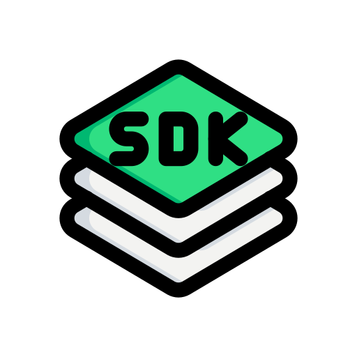

<div align="center">
  
  <br/>
  <h2>PaddleWrapper</h2>
  <br/>
  
  🚀 A modern, powerful, and developer-friendly .NET SDK for Paddle API. Accelerate your development process with type-safe API design, comprehensive documentation, and rich feature set.

  [](https://www.nuget.org/packages/PaddleWrapper/)
  [](https://www.nuget.org/packages/PaddleWrapper/)
  [](LICENSE)
</div>

## Features

- ⚡ Async/await first design
- 🛠️ Built with modern C# features
- 🎯 Full support for Paddle API v2
- 📝 Comprehensive XML documentation
- 🌐 Supports both .NET Standard 2.0 and 2.1
- 🔒 Type-safe API with full IntelliSense support
- 📦 No external dependencies except System.Text.Json

## Installation

Install via NuGet Package Manager:

```bash
Install-Package PaddleWrapper
```

Or via .NET CLI:

```bash
dotnet add package PaddleWrapper
```

## Quick Start

```csharp
// Initialize the client
var client = new PaddleClient("your-api-key");

// List all products
var products = await client.Products.ListAsync();

// Get a specific product
var product = await client.Products.GetAsync("prod_123");

// Create a new customer
var customer = await client.Customers.CreateAsync(new Customer 
{
    Email = "customer@example.com",
    Name = "John Doe"
});

// Create a subscription
var subscription = await client.Subscriptions.CreateAsync(new Subscription 
{
    CustomerId = customer.Id,
    Items = new[] 
    {
        new SubscriptionItem 
        {
            PriceId = "pri_123",
            Quantity = 1
        }
    }
});
```

## Supported APIs

- ✅ Products API
- ✅ Prices API
- ✅ Customers API
- ✅ Transactions API
- ✅ Subscriptions API
- ✅ Webhooks API
- ✅ Notifications API
- ✅ Discounts API
- ✅ Addresses API
- ✅ Businesses API

## Detailed Usage Examples

### Working with Products

```csharp
// List all products
var products = await client.Products.ListAsync();

// Get a specific product
var product = await client.Products.GetAsync("prod_123");

// Create a new product
var newProduct = await client.Products.CreateAsync(new Product 
{
    Name = "My Product",
    Description = "Product description"
});

// Update a product
var updatedProduct = await client.Products.UpdateAsync("prod_123", product);
```

### Working with Subscriptions

```csharp
// Create a subscription
var subscription = await client.Subscriptions.CreateAsync(new Subscription 
{
    CustomerId = "ctm_123",
    Items = new[] 
    {
        new SubscriptionItem 
        {
            PriceId = "pri_123",
            Quantity = 1
        }
    }
});

// Pause a subscription
await client.Subscriptions.PauseAsync("sub_123");

// Resume a subscription
await client.Subscriptions.ResumeAsync("sub_123");

// Cancel a subscription
await client.Subscriptions.CancelAsync("sub_123");
```

### Error Handling

```csharp
try 
{
    var product = await client.Products.GetAsync("prod_123");
} 
catch (HttpRequestException ex) 
{
    // Handle API errors
    Console.WriteLine($"API error: {ex.Message}");
}
```

## Target Frameworks

- .NET Standard 2.0
- .NET Standard 2.1

This means the library can be used in:
- .NET Core 2.0+
- .NET 5+
- .NET Framework 4.6.1+
- Xamarin.iOS 10.14+
- Xamarin.Mac 3.8+
- Xamarin.Android 8.0+
- Universal Windows Platform 10.0.16299+
- Unity 2018.1+

## Contributing

Contributions are welcome! Feel free to submit a Pull Request. Please read our [Contributing Guidelines](CONTRIBUTING.md) before submitting a PR.

## License

This project is licensed under the MIT License - see the [LICENSE](LICENSE) file for details.

## Acknowledgments

- Inspired by official Paddle SDKs for other languages
- Thanks to Paddle for their excellent API documentation

## Support

If you encounter any issues or need help, please:
1. Search in [existing issues](https://github.com/yazilimacademy/paddle-wrapper/issues)
2. Create a new issue if your problem is not addressed yet

## Disclaimer

This is an unofficial SDK and is not affiliated with, maintained, authorized, endorsed or sponsored by Paddle.